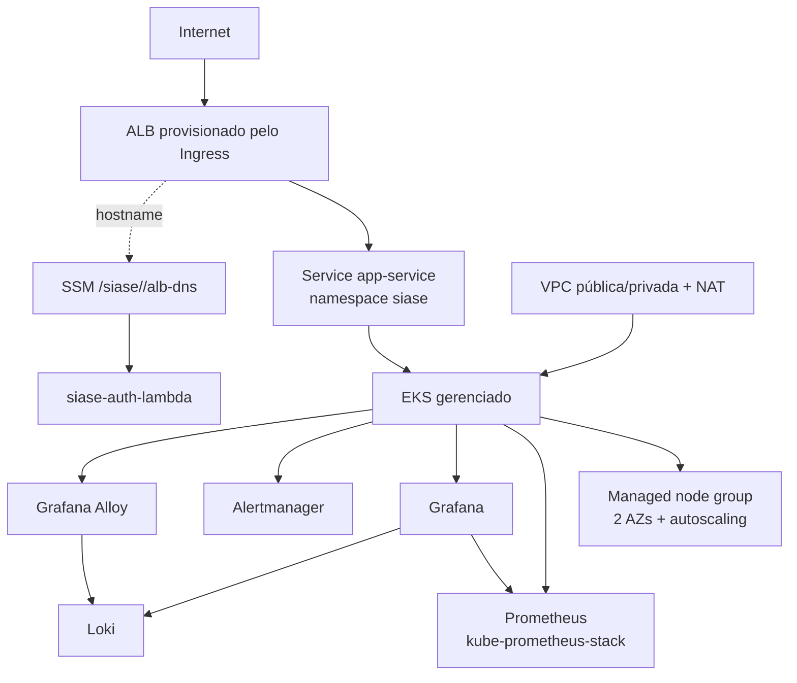

# SIASE - infraestrutura Kubernetes e observabilidade

Repositório da infraestrutura da Fase 3 para o cluster Kubernetes gerenciado da
aplicação SIASE. O código cria a rede AWS, o EKS, o AWS Load Balancer Controller,
o stack de observabilidade e o parâmetro SSM consumido pelo repositório
`siase-auth-lambda`.

A entrega foi validada por formatação, validação Terraform,
renderização Helm, JSON e regras Prometheus. O apply deve ser realizado somente
em uma conta AWS Student, usando OIDC na pipeline ou credenciais locais
temporárias.

## Arquitetura



### Componentes

- VPC com duas subnets públicas, duas privadas e NAT Gateway, distribuídas em
  duas AZs;
- EKS gerenciado com managed node group e escala configurável;
- `metrics-server` para suportar HPA e métricas de pods;
- AWS Load Balancer Controller usando IRSA;
- `kube-prometheus-stack`, contendo Prometheus, Grafana e Alertmanager;
- Loki em modo SingleBinary com armazenamento local para esta entrega;
- **Grafana Alloy** como agente de coleta e envio de logs para Loki;
- ConfigMap de dashboard com o label `grafana_dashboard=1`;
- `PrometheusRule` com os alertas operacionais;
- parâmetro SSM com placeholder até o ALB existir.

## Agente de logs escolhido

O agente é o **Grafana Alloy**, instalado pelo chart `grafana/alloy`. Ele é o
agente mantido pela Grafana para coleta e encaminhamento de telemetria,
incluindo logs para Loki. O Promtail não foi escolhido: a linha do Promtail
entrou em manutenção encerrada/depreciação e não é uma escolha adequada para
uma instalação nova. O Alloy também permite processar os logs JSON da
aplicação e promover `correlationId`, `subject` e `level` a labels Loki.

Os logs do `siase-app` já são JSON e contêm `correlationId` e `subject`, o que
permite correlacionar uma requisição entre aplicação e observabilidade.

## Ordem de aplicação

1. Criar o bucket S3 e a tabela DynamoDB usados pelo backend Terraform, fora
   deste estado ou por um bootstrap separado.
2. Criar no Secrets Manager o segredo do Grafana. O JSON deve conter:

   ```json
   {
     "password": "valor-fora-do-git"
   }
   ```

3. Copiar um arquivo de ambiente:

   ```bash
   cp environments/homolog.tfvars.example environments/homolog.tfvars
   ```

   Ajuste região, ARN do segredo e tamanhos dos nodes. Os arquivos `.tfvars`
   reais são ignorados pelo Git.

4. Inicializar e validar o backend:

   ```bash
   terraform init \
     -backend-config="bucket=BUCKET_DO_ESTADO" \
     -backend-config="dynamodb_table=siase-terraform-lock"
   terraform plan -var-file=environments/homolog.tfvars
   terraform apply -var-file=environments/homolog.tfvars
   ```

   Em ambiente sem backend, a validação local usa:

   ```bash
   terraform init -backend=false
   terraform validate
   ```

5. O Terraform instala os charts, namespaces, dashboard e publica o parâmetro
   SSM com o valor inicial `PENDING_ALB_DNS`.
6. Aplicar os recursos do Alertmanager e das regras:

   ```bash
   aws eks update-kubeconfig --region "$AWS_REGION" --name "$EKS_CLUSTER_NAME"
   kubectl apply -f k8s/alertmanager-config.yaml
   kubectl apply -f k8s/prometheus-rule.yaml
   ```

7. Aplicar os manifests da aplicação a partir do repositório `siase-app`.
   O Ingress `siase-ingress` cria o ALB através do AWS Load Balancer
   Controller.
8. Depois que o hostname estiver preenchido no status do Ingress, publicar o
   DNS no SSM:

   ```bash
   alb_dns="$(kubectl get ingress -n siase siase-ingress \
     -o jsonpath='{.status.loadBalancer.ingress[0].hostname}')"
   aws ssm put-parameter \
     --name "/siase/homolog/alb-dns" \
     --type String \
     --value "$alb_dns" \
     --overwrite
   ```

   Os workflows automatizam esta espera e publicação. A Lambda de autenticação
   só deve ser aplicada/atualizada depois dessa etapa, salvo uso de override.

## Terraform

Os módulos oficiais usados são:

- `terraform-aws-modules/vpc/aws` `5.21.1`;
- `terraform-aws-modules/eks/aws` `20.37.1`.

Os providers e charts têm versões fixadas nos arquivos Terraform. O node group
possui `min_size`, `desired_size` e `max_size`, e o `metrics-server` habilita
autoscaling baseado em métricas de pods. A aplicação pode continuar usando o
HPA do repositório `siase-app`.

O parâmetro SSM é declarado assim conceitualmente:

- nome padrão: `/siase/<ambiente>/alb-dns`;
- valor inicial: `PENDING_ALB_DNS`;
- `lifecycle.ignore_changes = [value]`.

Isso evita que um `terraform apply` posterior sobrescreva o hostname real
publicado pelo workflow.

## Grafana

O Grafana recebe:

- datasource Prometheus provisionado pelo `kube-prometheus-stack`;
- datasource Loki apontando para o gateway interno do Loki;
- senha administrativa obtida do Secrets Manager através de
  `grafana_secret_arn`;
- dashboard `SIASE - Visão operacional` via ConfigMap com
  `grafana_dashboard=1`.

Para acessar sem expor o serviço publicamente:

```bash
kubectl -n monitoring port-forward svc/kube-prometheus-stack-grafana 3000:80
```

Acesse `http://localhost:3000`. O usuário padrão é `admin`, salvo alteração em
`grafana_admin_user`; a senha vem do segredo configurado.

O dashboard inclui:

- volume diário de ordens de serviço;
- tempo médio e p95 por status;
- tempo médio e volume de itens iniciados;
- latência p95/p99 das APIs;
- taxa de erro 5xx;
- falhas de integração;
- CPU e memória por pod;
- uptime da aplicação;
- disponibilidade do scrape.

O `Prometheus` captura o `ServiceMonitor` do `siase-app` porque:

- o `ServiceMonitor` existente usa o label
  `release: kube-prometheus-stack`;
- `serviceMonitorSelector` usa o mesmo label;
- `serviceMonitorNamespaceSelector: {}` permite descoberta entre namespaces;
- o endpoint segue sendo `app-service:management` em
  `/actuator/prometheus`.

## PromQL do dashboard

As consultas abaixo foram mantidas conforme o contrato fornecido:

| Painel | Consulta |
| --- | --- |
| Volume diário de OS | `sum(round(increase(siase_ordens_servico_criadas_total{application="siase"}[1d])))` |
| Tempo médio por status | `sum by (status) (rate(siase_ordem_servico_tempo_status_seconds_sum{application="siase"}[$__rate_interval])) / sum by (status) (rate(siase_ordem_servico_tempo_status_seconds_count{application="siase"}[$__rate_interval]))` |
| P95 por status | `histogram_quantile(0.95, sum by (status, le) (rate(siase_ordem_servico_tempo_status_seconds_bucket{application="siase"}[$__rate_interval])))` |
| Tempo médio de item | `sum(rate(siase_execucao_item_tempo_seconds_sum{application="siase"}[$__rate_interval])) / sum(rate(siase_execucao_item_tempo_seconds_count{application="siase"}[$__rate_interval]))` |
| Itens iniciados | `sum(round(increase(siase_execucao_item_iniciadas_total{application="siase"}[1d])))` |
| Latência p95 | `histogram_quantile(0.95, sum by (uri, le) (rate(http_server_requests_seconds_bucket{application="siase"}[$__rate_interval])))` |
| Latência p99 | `histogram_quantile(0.99, sum by (uri, le) (rate(http_server_requests_seconds_bucket{application="siase"}[$__rate_interval])))` |
| Taxa 5xx | `sum(rate(http_server_requests_seconds_count{application="siase",status=~"5.."}[$__rate_interval])) / sum(rate(http_server_requests_seconds_count{application="siase"}[$__rate_interval]))` |
| Falhas de integração | `sum by (integracao) (increase(siase_falhas_integracao_total{application="siase"}[1h]))` |
| CPU por pod | `sum by (pod) (rate(container_cpu_usage_seconds_total{namespace="siase",container!=""}[$__rate_interval]))` |
| Memória por pod | `sum by (pod) (container_memory_working_set_bytes{namespace="siase",container!=""})` |
| Uptime | `process_uptime_seconds{application="siase"}` |
| Scrape | `up{namespace="siase"}` |

## Alertas

O arquivo `k8s/prometheus-rule.yaml` declara `PrometheusRule` com:

- latência p95 acima de 1 segundo por 10 minutos;
- taxa de erro 5xx acima de 5% por 5 minutos;
- falha no processamento de ordens;
- mais de cinco falhas de integração em 15 minutos;
- aplicação sem targets disponíveis;
- pod não pronto;
- CPU acima de 85% do limite;
- memória acima de 90% do limite.


## CI/CD e configuração do GitHub

O workflow reutilizável `.github/workflows/build-test.yml` executa:

```text
terraform fmt -check -recursive
terraform init -backend=false
terraform validate
```

`ci.yml` chama esse workflow em pull requests para `main` e `develop`.
`deploy-homolog.yml` roda em push para `develop`; `deploy-prod.yml` roda em
push para `main`. Ambos exigem o job `build-test` e usam AWS OIDC.

Em cada GitHub Environment (`homolog` e `production`), crie:

**Variables**

```text
AWS_REGION
EKS_CLUSTER_NAME
TF_STATE_BUCKET
TF_LOCK_TABLE
GRAFANA_SECRET_ARN
```

**Secret**

```text
AWS_DEPLOY_ROLE_ARN
```

A role assumida pelo GitHub deve permitir apenas as operações necessárias ao
deploy do ambiente, e confiar no provider OIDC do GitHub com restrição ao
repositório e ao ambiente. Não crie access key estática, PAT ou senha no
workflow.

## Validação local

Os comandos esperados antes de uma alteração ser integrada são:

```bash
terraform fmt -check -recursive
terraform init -backend=false
terraform validate
python3 -m json.tool dashboards/siase-overview.json >/dev/null
promtool check rules /tmp/siase-prometheus-rules.yaml
helm template kube-prometheus-stack prometheus-community/kube-prometheus-stack \
  --version 61.7.2 \
  --namespace monitoring \
  -f helm/kube-prometheus-stack-values.yaml
```

Como o arquivo de regras é um CRD `PrometheusRule`, o bloco `spec.groups` é
extraído para um arquivo de regras Prometheus antes do `promtool check rules`.
Isso valida a sintaxe que o Prometheus executará, sem fingir que o `promtool`
valida o envelope Kubernetes.

